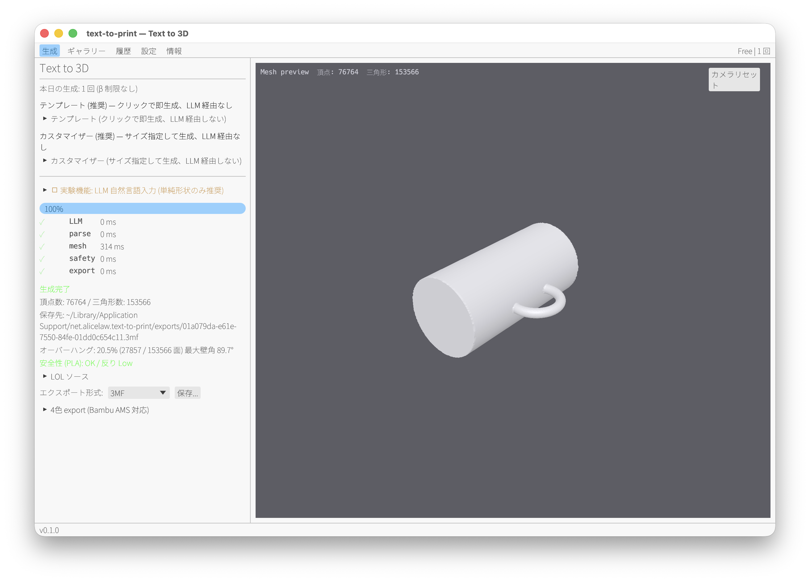
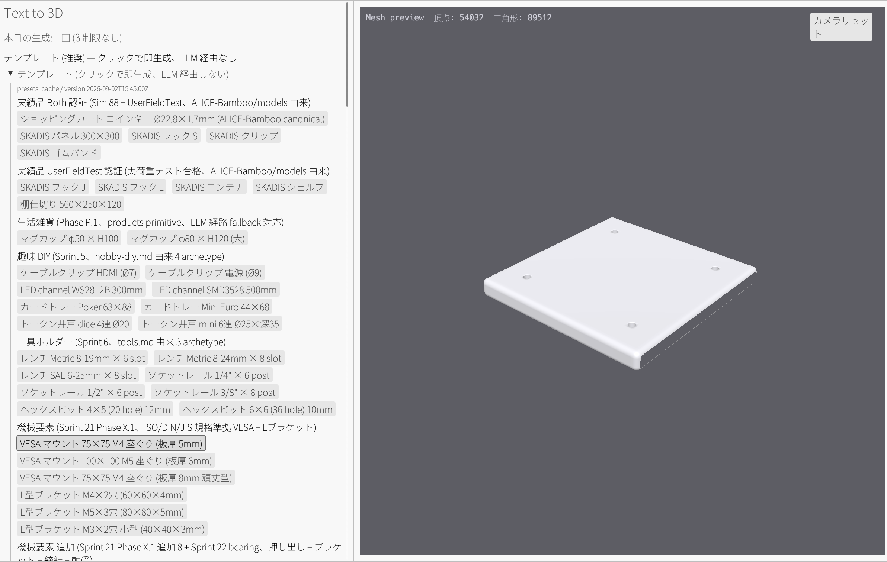
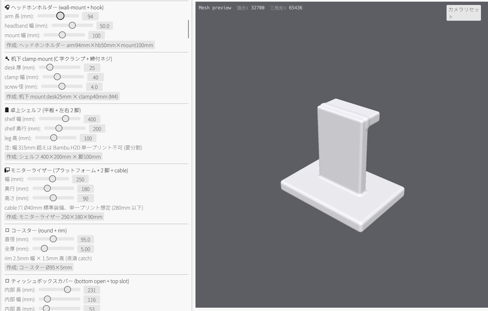
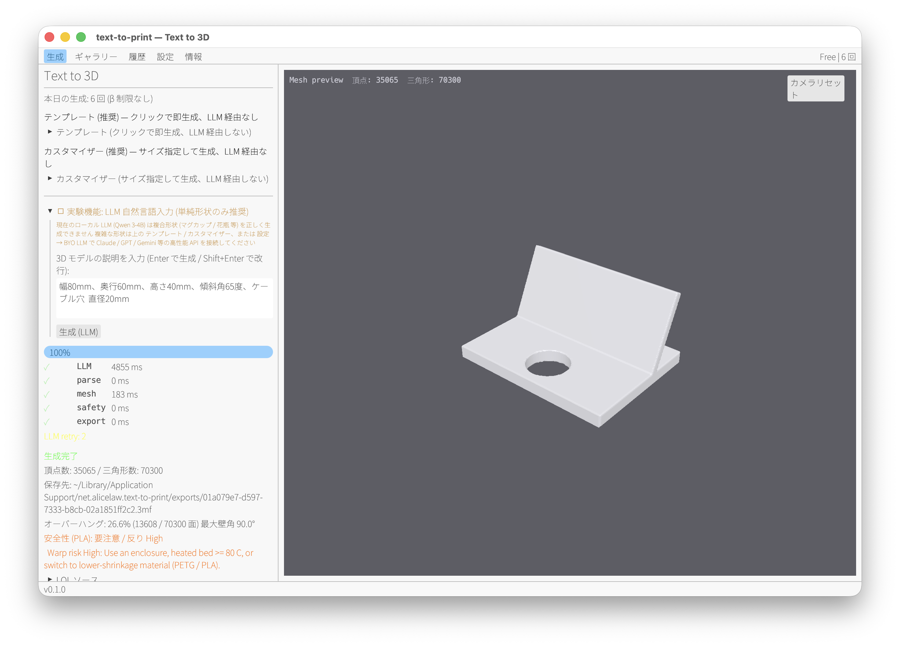
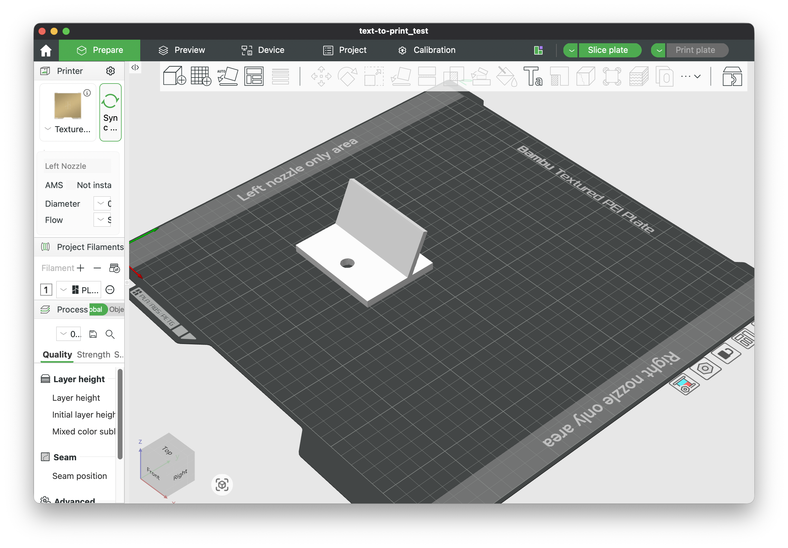
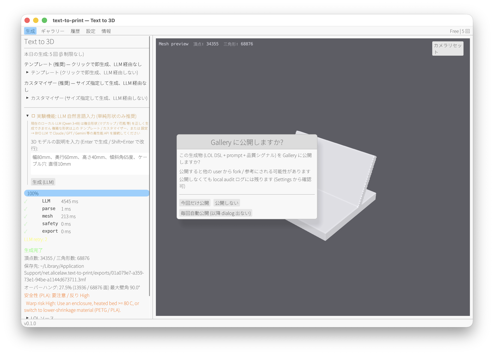
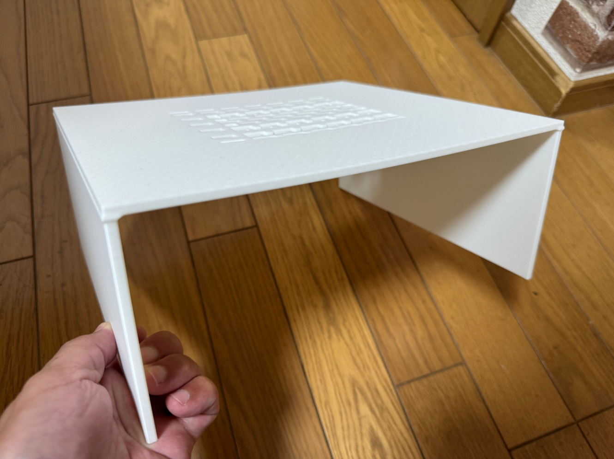

# text-to-print

**[English](README.md) | [日本語](README.ja.md)**

Fully-local desktop app that generates 3D print files (3MF / G-code) directly
from natural language, with an embedded small LLM

Describe what you want to print, hit generate, get a slicer-ready file No
cloud, no login for the local pipeline

```
Text prompt
    │
    ▼
Embedded ALICE-LLM (Qwen 3.5-4B Q4_K_M / Bonsai 27B Q1_0)
    │  system prompt = LOL DSL Text-to-CAD instructions
    │  LoRA fine-tune (523+ samples, growing via free-tier contributions)
    ▼
LOL DSL source
    │
    ▼
ALICE-LOL parser → SdfNode tree
    │
    ├── Thick parts: ALICE-SDF marching cubes → watertight mesh (standard)
    │
    └── Thin parts (< 5mm): ALICE-SDF dual_contouring → watertight mesh
                            (Hermite data preserves features; even 1.7mm
                             thin parts yield non_manifold_edges=0 in
                             practice, avoiding the 24,808 non-manifold
                             issues seen with MC at resolution 512)
    │
    ▼
ALICE-Physics print-safety pipeline
  - thin-wall check
  - overhang report + heatmap
  - support volume mm³ estimate
  - warp risk
  - beam stress + buckling (when loads are specified)
    │
    ▼
ALICE-Bamboo 3MF export (+ optional 4-color AMS split, overhang layer)
  or STEP export via alice-sdf (CAD import into Fusion 360 / FreeCAD)
  or direct G-code via alice-print (Bambu Studio not required)
    │
    ▼
.3mf file → open in Bambu Studio → print
.step file → import into Fusion 360 / FreeCAD for CAD tweak
.gcode file → send straight to printer (Bambu / Marlin / Klipper)
```

All computation runs on a single machine No cloud GPU required LLM inference
uses [ALICE-LLM](https://github.com/ext-sakamoro/ALICE-LLM) with hybrid
CPU/GPU DeltaNet+Attention and wgpu compute shaders

## Screenshots

<!--
  Assets are stored under `docs/images/` and referenced from this section
  Capture guide (Ja/En file names, recommended sizes, ffmpeg conversion
  commands, English UI launch instructions) is in `docs/images/CAPTURE_GUIDE.md`
  UI language switch: Settings tab → Language → "English" or env `APP_LANG=en`
-->

### Japanese UI

| | |
|--|--|
|  |  |
| **App hero** — Generate UI + 3D mesh preview | **Templates** — one-click presets + Cloudflare sync source |
|  |  |
| **Customizer** — tune dimensions with sliders → instant generate | **LLM path** — natural-language prompt → LOL DSL |
|  |  |
| **Bambu Studio** import view | **Gallery** — publish output to other users via DID + ed25519 (Cloudflare Relay) |

### English UI

> 📸 English UI screenshots are pending capture — the images below currently show the Japanese UI as a temporary placeholder and will be replaced with the English-UI captures in a future release The layout / controls are identical regardless of the language

Switch UI language in **Settings > Language** (live, no restart) or launch with `APP_LANG=en`

| | |
|--|--|
|  |  |
| **App hero** — Generate UI + 3D mesh preview | **Templates** — one-click presets + Cloudflare sync source |
|  |  |
| **Customizer** — tune dimensions with sliders → instant generate | **LLM path** — natural-language prompt → LOL DSL |
|  |  |
| **Bambu Studio** import view | **Gallery** — publish output to other users via DID + ed25519 (Cloudflare Relay) |

### Print result (language-neutral)

| |
|--|
|  |
| **Actual print** — SKADIS shelf, generated by the alice-bamboo pipeline and now in daily use (Bambu Lab H2D output) |

Capture / GIF conversion guide (Ja/En versions included): [`docs/images/CAPTURE_GUIDE.md`](docs/images/CAPTURE_GUIDE.md)

## Pricing

Minimal setup as a tool for individuals All managed via Stripe subscription
(Phase S1/S2 shipped; Live cutover in S3 kicks off billing)

| Tier | Price | Sharing behavior |
|--|--|--|
| **Free** | ¥0 | Generated LOL DSL + 3MF is opt-in shared with the ALICE-LOL project (contributes to LoRA training data, benefiting all users) |
| **Pro Monthly** | ¥3,000/mo | Fully offline (LoRA sharing forced OFF), unlimited generation |
| **Pro Yearly** | ¥30,000/yr (-17%) | Same as Monthly with annual discount |
| **Enterprise** | Contact us | Multi-user / commercial / custom features — mailto:contact@extoria.co.jp |

Free-tier contributions grow the LoRA training set, and improvements in
model generation quality flow back to every user (flywheel) Paid tiers
guarantee privacy (fully offline; generated artifacts stay local)

Licenses are verified offline on the client via Ed25519 signatures; a
3-day grace period after cancellation auto-rolls back to Free tier The
backend runs on the Cloudflare Workers free tier (`crates/worker`) with
email delivery via Resend All Rust

## Tech stack

| Layer | Technology |
|--|--|
| GUI | Rust `eframe` + `egui` + `wgpu` (native desktop) |
| LLM inference | ALICE-LLM embedded (wgpu compute shaders + GGUF K-quant + LOL_GBNF grammar constrained decoding) |
| DSL parse / SDF / mesh | alice-lol / alice-sdf / alice-physics / alice-bamboo (path deps) |
| 3D preview | in-process wgpu **mesh** viewer (same `alice_sdf::mesh::Mesh` the exporter writes to 3MF — viewer and Bambu Studio look identical) |
| Gallery / share | Cloudflare Worker relay canonical (list / publish / delete, ed25519 sig verify, 100KB LOL max, rate limit); legacy libp2p (mdns / gossipsub / kad) remains as path deps but is unused in β |
| Identity | ed25519 DID (`did:key:<64hex>`, `identity.key` auto-generated on startup, no user sign-up path) |
| Local DB | rusqlite (project history / license state / tier / model choice / nickname / gallery_auto_share) |
| Payment | Stripe subscription (Test mode scaffold complete; Live cutover in Phase S3) |
| Backend | Cloudflare Workers wasm32 (`crates/worker`, share endpoint + Stripe webhook + license issuance + preset library `/api/presets` KV-backed + gallery `/api/gallery/{list,publish,:id}` D1-backed) |
| License | Ed25519 (`ed25519-dalek`, `text_to_print_core::license` client-side offline verify) |
| Email | Resend API (license delivery; log-only fallback if backend unset) |
| Auto-update | GitHub Releases + `self-update` (crates/app/src/updater.rs) |

## Export formats

| Format | Path | Producer | Use |
|--|--|--|--|
| **3MF (MakerWorld compatible)** | `alice_bamboo::bambu_3mf::export_bambu_3mf` (template embed, 12-file zip, Phase 5.7) | Bambu Lab AMS / MakerWorld direct upload | Standard FDM print |
| **STL** | `alice_bamboo::print_export::lol_to_stl` (post Stage 4 consolidation) | Any slicer | Legacy pipelines |
| **FBX** | `alice_bamboo::print_export::lol_to_fbx` (post Stage 4 consolidation) | 3D animation / game engines | Non-print exchange |
| **STEP** | `alice_sdf::io::step::export_step` | Fusion 360 / FreeCAD / SolidWorks | CAD editing round-trip |
| **G-code** | `alice_print::slice_sdf` (Bambu preset, Marlin flavor) | Direct-to-printer | Skip Bambu Studio |
| **3MF (4-color)** | `alice_bamboo::color4::quantize_to_4color` | Bambu Lab AMS 4-filament | Multi-color print |

## Repository layout

```
text-to-print/
├── crates/
│   ├── app/       - Rust desktop GUI (egui + wgpu, main entry, Settings
│   │                includes Upgrade / License key entry / profile (nickname) UI,
│   │                ui/gallery.rs (Cloudflare relay path + fork/delete),
│   │                ui/share_confirm.rs (Phase 2 modal, 3 choices))
│   ├── core/      - LOL → mesh export pipeline, Ed25519 license
│   │                verify, tier management, rusqlite persist,
│   │                pipeline::preview_lol_to_mesh (gallery preview)
│   ├── llm/       - Sidecar + Embedded backend (Qwen3.5-4B / Gemma2-27B /
│   │                Bonsai27B) + LOL_GBNF grammar constrained decoding
│   ├── network/   - identity (DID + ed25519 key auto provision),
│   │                gallery_client (Cloudflare relay list/publish/delete,
│   │                canonical msg + sig), share (LoRA dry-run + upload
│   │                queue), legacy libp2p (unused; deletion considered in Phase X)
│   └── worker/    - Cloudflare Workers wasm32 backend (share endpoint +
│                    Stripe webhook + license issuance + Resend email +
│                    preset library `/api/presets` (KV-backed, Sprint X.1) +
│                    gallery `/api/gallery/{list,publish,:id}` (D1-backed,
│                    ed25519 sig verify, Phase 3); excluded from workspace,
│                    operated via `wrangler deploy`)
├── datasets/      - LoRA training data (523+ samples, growing)
├── scripts/       - LoRA training / dataset generation
├── assets/        - static resources (NotoSansJP.ttf, etc.)
├── docs/          - design / release / share / STRIPE_SETUP / images
├── ROADMAP.md     - milestone breakdown for v0.1.0 β / GA / v1.0.0 commercial
└── .cargo/        - audit.toml (cargo audit ignore list, per-entry rationale)
```

## Status

**Standalone desktop app** (v0.1.0 β release, 2026-08-22) Core pipeline
(text prompt → embedded ALICE-LLM → LOL DSL → SDF → MakerWorld-compatible
12-file zip 3MF) is complete, Stripe subscription integration on backend +
app UI is complete (Test mode)

- `cargo test --workspace`: **368 pass / 0 fail / 6 ignored** (measured 2026-09-04)
- `cargo test --lib on crates/worker`: **48 pass / 0 fail** (2026-09-04, reflects preset seed count 25 cat/161 presets)
- `cargo clippy --workspace --all-targets -- -D warnings`: **0 own warnings**
- `cargo check --target wasm32-unknown-unknown -p text-to-print-worker`: **green**
- `RUSTDOCFLAGS='-D warnings' cargo doc --workspace --lib --no-deps`: **green**
- **CI**: ALICE-LOL / text-to-print repositories GitHub Actions **success** (2026-09-04 CI run `33828102104`, 18m49s success)
- **Preset library**: **25 categories / 161 presets** (Sprint 1-22 + Multi-domain 4-domain rollout complete; ALICE-Bamboo canonical + mechanical elements + furniture + architecture + electronics)
- **Customizer**: **75 archetypes** with slider tuning (Sprint 1-20 61 + Sprint 21-22 + Multi-domain 16 added, 2026-08-31)
- **UI language**: **Japanese-first** (during β) Tab labels support English switching; the 300 in-app UI strings are hardcoded in Japanese Full English i18n (Ja/En parity) is planned for post-β [ROADMAP P1-11](ROADMAP.md) English users can operate via README + Google Translate; prioritized when demand rises

Milestone breakdown and remaining tasks to v0.1.0 β / v0.1.0 GA / v1.0.0
commercial release are in [`ROADMAP.md`](ROADMAP.md)

Recent changes:
- 2026-09-01 to 09-04: **Phase C cavity margin rule fundamental refactor** — Resolved at the primitive API level the recurring cavity margin oversight across 6+ commits (arduino/pixhawk/servo/raspi/mount/reinforcement/counterbore/countersink/pin_hinge/heat_set_array/bearing_seat) Added `stdlib::hardsurface::cavity` module in ALICE-LOL (6 helpers: `subtract_through_screw_hole` / `subtract_through_counterbore` / `subtract_through_countersink` / `subtract_through_cylinder` / `subtract_blind_pocket` / `subtract_blind_heat_set`), making the cavity margin rule (5mm each side for through, 5mm above for blind) intrinsic to the helper API Refactored 7 archetypes (vesa/arduino/pixhawk/servo/raspi/heat_set/bearing) via helpers, 238→170 lines (28.6% net reduction) Also caught a pixhawk damper pocket bug (cavity margin was 0 in the old code)
- 2026-08-31: **Customizer 16 archetype expansion** — Added slider UI to all mechanical Sprint 21-22 + Multi-domain archetypes (VESA/L bracket/T-slot/raspi/heat_set/flange/dovetail/profile/snap-fit/boss array/bearing/cable_grommet/curtain rod/arduino/pixhawk/servo) Customizer 59→75 archetypes
- 2026-08-27 to 08-28: **Sprint 21-22 + Multi-domain 4-domain rollout** — Added mechanical elements (VESA/L-bracket/T-slot/heat-set/flange/dovetail/profile/snap-fit/boss array/bearing) + furniture (cable_grommet/dowel_hole) + architecture (curtain_rod_bracket/wood_screw_pilot) + electronics (arduino_mount_plate/pixhawk_mount/servo_mount/jst_ph_slot), totaling 17 archetypes + 21 primitives to the LOL DSL Extended MetricSize with M2/M2.5 + added BearingKind (608/688/6001/6202), compliant with ISO/DIN/JIS/McMaster
- 2026-08-26: **Gallery Phase 1-3 added** — nickname (display name entry in Settings > Profile, gallery display falls back to DID hex) + share confirm modal (on Free tier, generation completion presents 3 choices: "Publish this time only / Do not publish / Always auto-publish", persisted via gallery_auto_share DB flag) + Cloudflare relay endpoint (`/api/gallery/{list,publish,:id}`, new D1 `text-to-print-gallery`, ed25519 sig verify, LOL 100 KB max, nickname 32 char max, rate limit UUID+IP hourly, canonical msg prefix prevents publish sig replay-as-delete) + app-side `gallery_client.rs` + full rewrite of gallery.rs (Cloudflare canonical, fork publish, 🗑 delete button for own posts, preview stub lifted and hooked into `pipeline::preview_lol_to_mesh`) No added user sign-up UX (DID + ed25519 auto-provisioned via `Identity::load_or_create` creating `identity.key` locally); added 2 columns `nickname` + `gallery_auto_share` to DB `profiles`; worker crate stays on edition 2021 (workspace excluded) Commits `c97a09b` / `36e9e0f` / `e9aa721` / `beaed29` / `886969e`; remaining pending items before public release are user-side `wrangler d1 create text-to-print-gallery` and 6 screenshots
- 2026-08-24: **Customizer reaches 61 archetypes (Sprint 12-20 batch)** — organizer
  series 49→61 (`hairdryer_holder / kcup_holder / hex_key_holder / wrap_holder /
  sock_divider / soap_tray / razor_holder / chopstick_holder / swatch_holder /
  tp_holder / sd_card_holder / driver_rack / cotton_dispenser / sink_caddy /
  clamp_rack / dry_box / outdoor_enclosure / jewelry_stand / phone_dock /
  cutting_board_rack / tape_dispenser / shower_caddy / caliper_holder /
  bag_clip_org / can_rack / led_hub_box / makeup_organizer`)
  Completed 100% of kitchen + electronics categories Deterministic slider
  path bypasses LLM, covering compound shapes (weak spot for 3B iGPU) via presets
- 2026-08-23: **β release polish — Settings → Network + path leak reduction + Screenshots section restructure**
  - **New Settings → Network section** (`crates/app/src/ui/settings.rs`) Custom URL entry for preset library endpoint (self-hosted mirror / via proxy), startup sync enable toggle (for offline operation), sidecar port override (when 8000/8001 conflicts with other apps) All 3 fields persist to DB `profiles` table, also overridable via `TTP_PRESETS_ENDPOINT` / `TTP_PRESETS_SYNC_DISABLE` / `TTP_SIDECAR_PORT` env vars
  - **Path leak reduction** Added `RUSTFLAGS = ["--remap-path-prefix", ...]` to `.cargo/config.toml`, generalizing `/Users/runner/.cargo/registry/...` (GitHub Actions runner path, byproduct of Rust panic info) to `/cargo/...` in release binary strings Resolves the minor privacy concern + reduces binary size by tens of KB
  - **README Screenshots section restructure** Hero GIF + 6-shot grid, capture procedures consolidated in `docs/images/CAPTURE_GUIDE.md`
- 2026-08-22: **Sprint X.1 Cloudflare preset library complete** — worker `/api/presets` KV-backed preset library deployment complete (Custom Domain `text-to-print.alicelaw.net`), app fetches in the background on startup → syncs 10 presets via ETag/304 cache path, UI shows a 3-tier "presets: Bundled / Cache / Cloud" label Added DB `presets_cache` (SQLite single row) + `PresetsSnapshot` + `spawn_presets_sync` mpsc → UI reflection β users can now auto-propagate newly added presets on startup As a side effect, upgraded worker crate 0.5→0.8 (wasm-bindgen schema mismatch fix) and improved logging (begin/304 info/error Debug/elapsed_ms, reflecting on the silent failure diagnosis event) Also, β verify caught that macOS + Tailscale MagicDNS was silently dropping the Cloudflare Custom Domain's A record; removing Tailscale resolved it permanently
- 2026-08-09: **SKADIS panel canonical alignment + Template architecture Phase T1** — 3-step fix of ALICE-LOL `skadis_panel_sdf` (Y thickness 17mm → 5mm, Stadium peg holes 5×15, connector holes 44 + mount holes 6, all 148 holes reproduced, shape matches Bambu production 3MF `~/ALICE-Bamboo/models/wall-organizer/skadis-300x300/skadis_panel_300x300.3mf`) + text-to-print pipeline `should_use_dual_contouring(dims)` helper for DC/MC route decision based on `aspect_ratio > 5.0 || min_dim <= 5.0` (root prevention of the bug where the old `thickness_y < 5.0` Y-axis-only decision routed SKADIS panels to MC and dropped peg holes) + Preview resolution 128→96 (aligned with Bamboo canonical, sample count 2.1M→885K = 2.4x reduction; SKADIS panel measured 25 min estimate → 5.3s, 285x speedup) + TEMPLATE_CATEGORIES refactored to 9 items in 2 categories derived from ALICE-Bamboo/models (dropped 15 handmade items, resolved anti-pattern E, 1:1 with 13 canonical patterns in `alice_lol::stdlib::pattern::registry::ALL`) + UI elapsed time display (state.rs `elapsed()` method)
- 2026-08-08: **3D preview replaced with mesh renderer** (retired WGSL raymarching) The generation pipeline uploads the same `Mesh` produced by MC/DC to wgpu vertex/index buffers and renders with Phong lit shading The viewer and Bambu Studio now display the same geometry, so verifying generation output is trustworthy (previously with raymarching, Y-up world / camera artifacts made shapes look different, causing confusion) `crates/app/src/sdf/` keeps its name but the contents are now a mesh pipeline
- 2026-08-07: **End-to-end pipeline reaches completion** — Revamped the LLM system_prompt with a wedge example that teaches Z-up convention + proper `rotate(90, 0, 0, cylinder(...))`, wired `fix_prompt::LolParseError` variant + directive to hook the retry loop on parse failures (previously silent break with empty suffix), lifted `max_retries` 1→2 + HTTP timeout 180→300s, fixed the silent `.ok()` discard bug in export Verified end-to-end that the current Qwen 3B (grammar OFF) reliably produces a Bambu Studio-displayable wedge shape 3MF from prompts like "smartphone stand, width 80mm..."
- 2026-08-07: **P2-1 Phase S1 + S2 complete** — Stripe subscription integration
  (CF Workers backend scaffold + app UI Upgrade section / Enter License Key / grace
  period display / Enterprise mailto entry) Completed in Test mode; Live cutover in Phase S3
- 2026-08-07: CI fixes (`cargo audit` ignore list with rationale `.cargo/audit.toml`,
  merged `fmt` job into `clippy-test-doc`, documented `ALICE_ECO_TOKEN` secret setup)
- 2026-08-07: `legacy-saas/` fully removed (2.6 GB uncompressed, 91 tracked files);
  fresh implementation if revived
- 2026-08-07: Added UI phase state machine tests, added wasm32 CI check for `crates/worker`
- 2026-08-06: Phase 5.7 complete (`alice_bamboo::bambu_3mf::export_bambu_3mf`, direct
  MakerWorld-compatible 12-file zip 3MF generation from Rust, template embedded)
- 2026-08-01: Stage 4 complete (alice-lol → alice-bamboo consolidation) + Stage 5
  (Freemium share/private opt-in) + Stage 3-C.11 (LOL_GBNF grammar constrained decoding)
- 2026-07-29: renamed `3dvbgaran` → `text-to-print` standalone pivot
- 2026-04-22: LoRA training pipeline (Paperspace A6000/A100) + 523 sample set
- 2026-04-18: Rust desktop app Phase 1-2 (egui + wgpu + libp2p)

## Install (β period, unsigned)

During the v0.1.0 β period, the macOS (`.tar.gz`) and Windows (`.msi` / `.zip`)
builds are distributed **unsigned** How to bypass OS warnings on install:

- **macOS**: Extract the `.tar.gz` in Finder → right-click the resulting `text-to-print` → **Open** → click **Open** in the "cannot verify developer" dialog (first launch only; subsequent launches are normal)
- **Windows**: If SmartScreen shows an "unrecognized app" warning, click **More info** → **Run** (direct `.msi` install works too; Authenticode-unsigned warning will appear)
- **Linux**: DL **`.AppImage` (portable, recommended)** → `chmod +x` → run `.deb` is limited to glibc 2.39+ environments (Ubuntu 24.04+ / Debian 13+); use AppImage or `.tar.gz` on older systems

Apple Developer Program enrollment + Windows Authenticode cert are planned for Phase S3 (Live billing cutover) onwards During β, we prioritize "installable" and accept the warning UX

### Platform verification status (measured 2026-09-07, at β release)

| Platform | Artifact | Build | Real-device operation | Note |
|--|--|--|--|--|
| **macOS Apple Silicon** (M1/M2/M3) | `.tar.gz` | ✅ CI green | ✅ M3 device verified | primary dev env |
| macOS Intel | `.tar.gz` | ✅ CI green | ⚠️ untested | build success only, real-device reports welcome |
| Windows 10/11 x64 | `.msi` / `.zip` | ✅ CI green | ⏳ pending | user-side verification planned (see `docs/WINDOWS_SMOKE_TEST.md`) |
| Linux x86_64 (Ubuntu 24.04+ / Debian 13+) | `.deb` | ✅ CI green | ⚠️ metadata verified | glibc 2.39 requirement (`dpkg-deb -I` confirmed) |
| Linux x86_64 (Ubuntu 22.04 / Debian 12) | `.AppImage` / `.tar.gz` | ✅ CI green | ⚠️ untested | static-pie recommended (portable) |
| **Linux arm64 Debian bookworm** (RasPi 5) | (source build) | ✅ verified | ✅ **CLI smoke OK** | 17m56s build, wgpu backend selected, ALICE node/P2P startup |
| **Linux arm64 Ubuntu 22.04** (Jetson Orin Nano) | (source build) | ✅ verified | ✅ **CLI smoke OK** | build success, wgpu backend selected, ALICE node/P2P startup |

**arm64 Linux measurements** (2026-09-07 RasPi 5 + Jetson Orin Nano):
- Rust workspace + 6 ALICE-* sibling deps all build successfully (~18 min on 4-core Cortex-A76 / ~6-core Ampere)
- Binary size: 36-37 MB (stripped, dynamically linked)
- Shared libs: `libssl.so.3` + `libdbus-1.so.3` + `libcrypto.so.3` (standard on Debian bookworm / Ubuntu 22.04)
- **wgpu backend auto-selection** (eframe: "Both glow and wgpu renderers are available. Using wgpu.")
- ALICE node + DID identity generation + libp2p P2P swarm startup ✅
- Real-device GUI startup test skipped (headless SSH), build + init phase verified

**Policy during β release**: For platforms awaiting real-device verification, the "build success only" state is stated explicitly Operation reports (bugs or "it works") are welcome via GitHub Issues arm64 Linux release artifact provisioning is under consideration for post-β via an arm64 job in release.yml (upon demand)

## Build

```bash
# Standalone desktop app
cargo build --release --package text-to-print

# Bundled LLM sidecar (`alice-llm-server` binary shipped alongside the app)
scripts/build_sidecar.sh

# LoRA license utility
cargo build --release --package text-to-print-core --bin gen-license-key
```

Requires:
- Rust 1.75+ (rust-toolchain.toml pinned)
- ALICE ecosystem sibling checkouts at `../ALICE-SDF`, `../ALICE-LOL`,
  `../ALICE-View`, `../ALICE-Physics`, `../ALICE-Bamboo`, `../ALICE-LLM`

> **Note**: `ALICE-Bamboo` (+ transitive dep `ALICE-Print`) are **private repos**
> A Fine-grained PAT with `Contents: Read-only` scope is required for source build
> (see `.github/workflows/ci.yml` for the `ALICE_ECO_TOKEN` setup steps)
> End users are encouraged to download binaries from [Releases](https://github.com/ext-sakamoro/text-to-print/releases)
> (`.tar.gz` / `.msi` / `.deb` / `.AppImage`)

The release installers (`.msi` follow-up pending, `.deb`, `.AppImage`,
`.tar.gz`, `.zip`) bundle `alice-llm-server` next to the desktop binary
`crates/llm/src/sidecar.rs::resolve_bin_path` looks in the exe directory
first, then falls back to `PATH`, so end users have nothing to install
separately

## Run

```bash
cargo run --release --package text-to-print
```

## LoRA training

523+ sample dataset for LOL DSL generation Fine-tune scripts run on
Paperspace A6000/A100

```bash
scripts/train_lora.py --config configs/lora_qwen3_5_4b.yaml
```

## License

- Code: MIT
- Assets and training data: see individual `LICENSE` files under `datasets/`

## Related repos

- [ALICE-LLM](https://github.com/ext-sakamoro/ALICE-LLM) — pure Rust LLM
  inference engine (embedded here)
- [ALICE-LLM-Studio](https://github.com/ext-sakamoro/ALICE-LLM-Studio) —
  general LLM chat desktop app (Tauri v2), sister project
- [ALICE-LOL](https://github.com/ext-sakamoro/ALICE-LOL) — LOL DSL parser and
  Text-to-CAD system prompt library
- [ALICE-Bamboo](https://github.com/ext-sakamoro/ALICE-Bamboo) — 3D print
  pipeline (LOL → SDF → Physics → 3MF export)
- [ALICE-Physics](https://github.com/ext-sakamoro/ALICE-Physics) —
  deterministic 128-bit fixed-point physics engine (print-safety verification)

## History

- 2026-07-29 standalone pivot: The project was previously a SaaS deployment
  (Cloudflare Tunnel + Supabase Auth + Stripe Billing + Next.js frontend +
  Rust API gateway) The SaaS layer has been retired in favor of the
  single-binary desktop app documented above
- 2026-08-07: `legacy-saas/` directory removed from the repository If a
  future Paid tier requires server-side payment / license issuance, it will
  be built fresh rather than reviving the retired SaaS code
